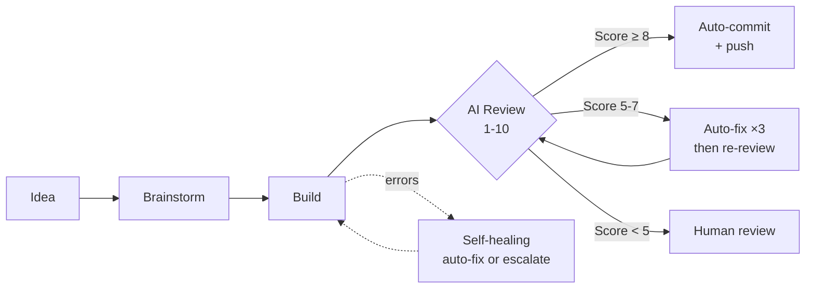

<div align="center">

# ◆ Claude Kanban

### Autonomous AI Build Pipeline

**Drop an idea. Walk away. Come back to committed code.**

[](https://github.com/divyamohan1993/claude-kanban/actions/workflows/ci.yml)
[](https://github.com/divyamohan1993/claude-kanban/actions/workflows/codeql.yml)
[](https://opensource.org/licenses/Apache-2.0)
[]()
[]()
[]()
[]()

<br>



</div>

---

Claude Kanban orchestrates autonomous [Claude Code](https://docs.anthropic.com/en/docs/claude-code) sessions as a zero-touch build-review-ship pipeline. You describe what you want; AI brainstorms, builds, reviews, fixes, and commits. You only step in when it can't fix itself.

5 dependencies. Zero build step. One command to start.

<br>

## ◆ Quick Start

> **Prerequisite:** [Claude Code](https://docs.anthropic.com/en/docs/claude-code) installed and authenticated.

```bash
# macOS / Linux
scripts/start.sh

# Windows
scripts\start.bat

# Or manual
pnpm install && pnpm start
```

Open `http://localhost:51777`. Stop with `scripts/stop.sh` or `scripts\stop.bat`.

<br>

## ◆ Two Modes

<table>
<tr>
<td width="50%">

### ◇ Single-Project (Autonomous)

Drop an `idea.md` in a folder. Walk away.

```
KANBAN_MODE=single-project
SINGLE_PROJECT_PATH=/path/to/project
AUTO_PROMOTE_BRAINSTORM=true
```

Discovery reads `idea.md` as the north star. Every 30 minutes it analyzes the codebase and creates improvement cards. Each card flows through brainstorm, spec, build, review, auto-fix, commit, push. No human needed.

```
/your/project/
  idea.md           ← your vision
  package.json      ← created by orchestrator
  src/              ← built autonomously
```

**Demo included:** `sudo bash autoconfig.sh` → option 1. Watch the orchestrator build an entire project from a single idea file.

</td>
<td width="50%">

### ◇ Global (Multi-Project)

Traditional kanban. You create cards, assign project folders, control every stage.

```
KANBAN_MODE=global
PROJECTS_ROOT=~/Projects
```

```
~/Projects/
  my-app/
  another-project/
```

Every stage requires manual approval: spec review, build start, code review, commit.

**Human authority in both modes:** Log in anytime. Revert files, reject cards (with reasons the AI learns from), stop builds, pause the pipeline. You always override the orchestrator.

</td>
</tr>
</table>

<br>

## ◆ What It Does

<table>
<tr>
<td>

#### ◇ Autonomous Pipeline
Create a card, pick a project folder, and the full cycle runs: brainstorm spec, snapshot files, build, AI review (1-10), auto-fix if needed, commit on approve, rollback on reject. Card dependencies respected. Concurrency configurable.

#### ◇ Self-Healing Engine
Error scanner runs every 30s, groups failures by card, auto-fixes (2 attempts), escalates to a new card if it can't. Intelligence engine learns patterns, auto-labels cards, tunes timeouts.

#### ◇ Rejection Learning
When you reject a card, the orchestrator asks why. Your feedback is stored and injected into future brainstorm and discovery prompts. The AI adapts to your preferences over time.

</td>
<td>

#### ◇ Real-Time Board
SSE live updates. Drag-and-drop. 9-step progress visualization. Labels, search, diff viewer, inline file editing. Dark mode. WCAG 2.2 AAA. Keyboard shortcuts (`N` new, `/` search, `D` dark mode).

#### ◇ Two-Server Security
Public board on `0.0.0.0`, admin panel on `127.0.0.1` (kernel-level TCP reject). Argon2id passwords, AES-256-GCM encryption, JWT auth, CSP nonce, CSRF, token bucket rate limiting. Roles: superadmin > admin > user.

#### ◇ Production Ops
Tiered backups (5min / hourly / daily). Factory reset. Health probes (`/health`, `/health/ready`). Structured JSON logging (pino). Heartbeat watchdog. Graceful shutdown with pipeline drain.

</td>
</tr>
</table>

<br>

## ◆ Deploy

| Method | Command | Use case |
|:------:|---------|----------|
| **Local** | `scripts/start.sh` | Dev, testing |
| **GCP Ubuntu** | `sudo bash autoconfig.sh` | Production (systemd, Nginx, UFW, auto-update) |
| **Docker** | `docker build -f deploy/Dockerfile -t claude-kanban .` | Containers |
| **Compose** | `cd deploy && docker compose up -d` | Self-hosting |
| **Kubernetes** | `kubectl apply -k deploy/k8s/` | Orchestrated |

See [Deployment](docs/deployment.md) for full details.

<br>

## ◆ Trust

<div align="center">

**305 automated tests** across 5 suites. [View the report &rarr;](public/product/trust/)

| Reliability | Dependency Audit | Performance | Data Durability | Code Quality |
|:-----------:|:----------------:|:-----------:|:---------------:|:------------:|
| **168** | **27** | **28** | **35** | **47** |

</div>

```bash
pnpm test              # all suites
pnpm test:reliability  # single suite
```

<br>

## ◆ Architecture at a Glance

```
┌─────────────────────────────────────────────────────────┐
│                    Cloudflare Edge                       │
│              DNS · CDN · WAF · DDoS Shield              │
└──────────────────────┬──────────────────────────────────┘
                       │
         ┌─────────────┴─────────────┐
         │                           │
    ┌────▼────┐               ┌──────▼──────┐
    │ Public  │               │   Admin     │
    │ :51777  │               │  :random    │
    │ 0.0.0.0 │               │ 127.0.0.1   │
    │         │               │ (TCP reject │
    │ Board   │               │  external)  │
    │ API     │               │             │
    │ SSE     │               │ Control     │
    │ Auth    │               │ Backups     │
    └────┬────┘               │ Users       │
         │                    └──────┬──────┘
         │                           │
    ┌────▼───────────────────────────▼────┐
    │          SQLite (WAL mode)          │
    │  cards · sessions · audit_log      │
    │  users · config · error_log        │
    │  learnings · checkpoints           │
    │  claude_usage                       │
    └──────────────────┬─────────────────┘
                       │
    ┌──────────────────▼─────────────────┐
    │           Service Layer            │
    │  Pipeline · Brainstorm · Review    │
    │  Auto-discover · Intelligence      │
    │  Snapshot · Git · Claude Runner    │
    └────────────────────────────────────┘
```

<br>

## ◆ Documentation

| | Document | What's Inside |
|-|----------|---------------|
| ◇ | [Architecture](docs/architecture.md) | Two-server design, service layer, database schema |
| ◇ | [Pipeline](docs/pipeline.md) | Build-review-ship cycle, auto-fix loop, self-healing |
| ◇ | [API Reference](docs/api.md) | 100 endpoints with request/response examples |
| ◇ | [Configuration](docs/configuration.md) | 70+ environment variables, custom prompts |
| ◇ | [Deployment](docs/deployment.md) | Local, Docker, K8s, GCP autoconfig |
| ◇ | [Security Audit](docs/security-audit.md) | Three audits, 35 findings + 72 CodeQL alerts fixed |

<br>

## ◆ Tech Stack

| Layer | Choice | Why |
|-------|--------|-----|
| Runtime | Node.js &ge; 18 | Zero-config, cross-platform |
| Server | Express | 5 deps, no framework overhead |
| Database | SQLite (WAL) | Single file, zero ops, instant backups |
| Auth | Argon2id + JWT + AES-256-GCM | Password hashing, tokens, field encryption |
| Frontend | Vanilla JS | No build step, 150KB total, ships as-is |
| Logging | Pino | Structured JSON, correlation IDs |
| CI | GitHub Actions | Matrix: Ubuntu/Windows, Node 18/22 |

<br>

<div align="center">

## ◆ License

[Apache 2.0](LICENSE) -- [Divya Mohan](https://dmj.one)

See [NOTICE](NOTICE) for attribution requirements.

---

<sub>◆ Built with care. Ships with confidence. ◆</sub>

</div>
